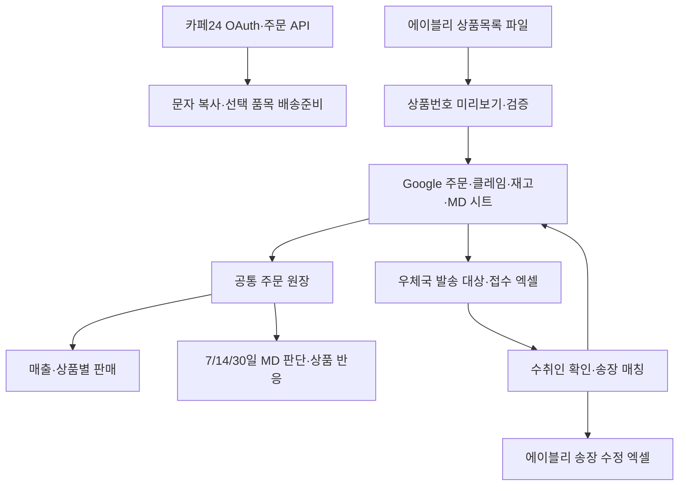

# OARS Manager 운영 감사 및 변경 기록

2026-09-17. 최초 감사 `cffc67b8`, 추가 main 변경 `778fcba`까지 반영.
운영 시트에는 쓰지 않았으며, 실제 카페24 주문상태도 변경하지 않았다.

## 실제 데이터 흐름

카페24 주문 조회와 Google 주문 원장은 **독립된 경로**다. 카페24에서 읽었다고 Google 시트에 자동 저장되지 않는다. 문자 발송은 복사 작업이며 SMS 전송 API가 아니다. 우체국은 접수용 파일 생성과 신청내역 붙여넣기 방식이며 직접 접수 API가 아니다. 에이블리 송장도 수정 파일 다운로드까지 구현되어 있고 플랫폼 자동 업로드는 없다. 재고는 시트 스냅샷이며 주문·반품에 따른 재고 이동 원장은 없다.

## 중요도순 발견사항

| 중요도 | 확인된 문제 / 영향                                                                                                  | 조치 및 남은 한계                                                                                                                                             |
| ------ | ------------------------------------------------------------------------------------------------------------------- | ------------------------------------------------------------------------------------------------------------------------------------------------------------- |
| P0     | Google API 조회·수정에 앱 관리자 인증 부재. 서비스 계정 권한으로 고객정보 조회·송장·상품번호 수정 가능              | 페이지 proxy와 모든 API handler에서 인증. 쓰기는 same-origin JSON만 허용. 환경변수 미설정 시 503. 외부 공격을 시도하지 않고 소스로 확인                       |
| P0     | 송장 저장이 클라이언트 행번호를 그대로 사용. 시트 정렬·삽입 후 다른 주문에 기록 가능                                | 상품주문번호로 최신 행 재조회, 수취인 snapshot 비교, 기존 송장 충돌·중복 차단, 저장 후 재검증. Sheets의 읽기/쓰기 사이 동시편집을 원자적으로 차단할 수는 없음 |
| P1     | 같은 주문을 중복 합산하고 홈/대시보드가 판매가×수량 여부도 다르게 계산                                              | 공통 원장, 동일 중복 제거, 충돌 중복 격리. `line`/`unit` 정의를 서버 설정으로 명시. 미설정은 기존 행 합계 기준을 유지하고 경고                                |
| P1     | 취소/반품 API마다 다른 고정 열. 일부 구현은 취소사유만 있어도 반품으로 분류하고 상품번호를 차감액으로 읽음          | 실헤더 매핑, 원주문 연결, 요청/완료 구분, 수량 검증, 완료분만 차감. 미매칭·수량 모호·중복 클레임 충돌은 보류                                                  |
| P1     | 배송준비 버튼이 같은 주문의 다른 신규 품목까지 변경. 품주코드가 없으면 전체 주문 변경 가능                          | 클릭한 품목 코드만 전송. 서버에서 최신 상태 확인 후 변경 및 재조회. 실제 쓰기는 미실행                                                                        |
| P1     | 원래 최근 30일 첫 100건(후속 수정 1,000건)만 조회. 누락을 0건처럼 볼 수 있음                                        | 최근 90일 페이지 순회, 중간 실패 시 부분 성공 금지, 요청 시간 제한. 90일 이전 미처리 주문은 카페24에서 확인 필요                                              |
| P1     | N02 외부마켓 주문 누락, 중첩 옵션에 object 문자열                                                                   | main 후속 수정 유지. N02 표시, 결제 T 확인 시에만 준비 가능. 중첩 옵션 표시 유지                                                                              |
| P1     | 홈에서 주문 1개도 A급·3~5개 사입. 취소 차감·미등록 재고·등록일을 충분히 반영하지 않음                               | 공통 MD 엔진, 미확정 클레임 제외한 유효 수요, 주문일 분산, 7/14/30일 비교, 재고/공급 조건별 판단 유보                                                         |
| P1     | 이름만 같은 수취인에게 송장 자동 연결. 같은 주문/송장이 여러 번 연결 가능                                           | 이름+연락처 또는 주소 일치와 유일성 필요. 중복은 차단. 합배송·분할배송은 자동 추정하지 않음                                                                   |
| P2     | 최근 기간 시작일에 현재 시각이 남아 첫날을 누락. 브라우저/서버 시간대 혼용. 과거 마지막 주문일을 오늘로 간주한 화면 | 한국 날짜의 달력일 단위 비교. 현재 날짜 기준. 미래 주문은 MD 계산 제외. 당일 진행 중 표시                                                                     |
| P2     | 재고 공란을 0으로 대체하고 이전 상품의 색상을 다음 상품에 상속                                                      | 신규 상품/빈 행에서 문맥 초기화. 미등록·수량 오류·동일 옵션 중복은 재고 미확인                                                                                |
| P2     | MD 카드 경계가 이웃 등록일·상품번호를 가져옴. 번호 미연결을 미등록으로 단정                                         | 카드 행/열 경계 분리. 번호 미연결은 미연결로 표시. 실제 등록일과 업로드일 대용 구분                                                                           |
| P2     | 상품명 일부·괄호 제거·유사도로 번호 확정, 미리보기 후 시트 변화 미확인                                              | 전체 상품명 보존 일치만 확정. 승인 cell+상품+번호 및 시트 hash 재확인. 쓰기 후 readback                                                                       |
| P2     | 실패 응답을 빈 배열로 처리하거나 분석 로딩이 계속됨. 갱신 실패 후 오래된 업무 대상 사용                             | 조회 실패를 오류로 노출, 이전 성공 데이터 표시 문구, 작업 대상 재조회. 읽기 429/502/503/504만 제한 재시도, 쓰기 자동 재시도 없음                              |
| P2     | DOM 직접 삽입 메뉴, 휴대폰 화면에서 대비·폭 문제, 분석 화면별 판단 상충                                             | React 메뉴 상태, 공통 분석, 모바일 가로 넘침 검사, 긴 표 내부 스크롤, 오류·재시도 표시                                                                        |
| P2     | XLSX 구버전·lockfile 부재. 파일 변환으로 원본 시트의 수식/셀정보 손실 가능                                          | 공식 SheetJS 0.20.3, 의존성 버전 고정 및 lockfile. 원본 워크시트의 송장 관련 셀만 수정                                                                        |

## 운영 시트에서 실제로 확인한 자료 문제

- 주문시트 302행과 304행: 같은 상품주문번호의 상태가 `배송중` / `상품 준비중`으로 다름. 최신 상태를 증명할 갱신시각이 없어 임의 선택하지 않음.
- 취소·반품 시트의 일부 후반부 행: 주문상태 헤더 위치에 `일반배송`이 들어 있음. 행별 옛 형식 혼재 가능성이 있어 자동 열 이동은 하지 않음.
- 일부 상품번호에 숫자 구분 쉼표가 있음. 숫자 그룹 형식의 쉼표만 제거하고 선행 0은 보존.
- `주문번호` 헤더가 두 번 등장. 앞쪽은 발주 관리 구간이고 뒤쪽은 에이블리 주문 구간이므로 뒤쪽을 사용.
- 조회한 주문 표본의 수량은 모두 1이라 판매가가 단가인지 행 합계인지 입증할 수 없었음. 수량 2개 이상의 원본 명세 확인이 필요.
- MD 실제 등록일·입고예정·예약재고·공급기간은 연결되지 않은 항목이 있음. 업로드일을 실제 등록일로 확정하지 않음.

행번호는 조회 당시 기준이며 이후 정렬 시 바뀐다. 고객 이름·전화·주소, 실제 주문 식별자, 서비스 계정 키는 이 보고서나 테스트에 추가하지 않았다.

## MD 규칙

1. 주문 반응 수량과 완료 클레임 차감 순판매를 분리. 진행 중 클레임은 잠정 순판매에 남지만 사입 수요에서 제외.
2. 7/14/30일 및 각각 직전 동일 기간을 비교. 수집 시작일이 확인되지 않으면 증감률의 강한 해석과 사입 확정 보류.
3. 14일 내 유효 3개 이상·서로 다른 3일 이상·최근 7일 유효 판매가 있어야 반복 수요 후보. 한 날짜의 대량 주문만으로 승격하지 않음.
4. S급은 추가로 30일 유효 8개·5일 이상 분산·최소 14일 지속·최근 7일 2개 이상·하루 집중도 50% 이하·완료 취소반품률 30% 이하. 이는 운영용 규칙이지 검증된 예측 모델이 아님.
5. 사입 검토는 실제 등록일, 충분한 수집 범위, 알려진 재고, 진행 중 클레임 해소 등 조건을 확인한 뒤 표시. 원천 오류가 있으면 보류.
6. 공급기간·입고예정·예약재고까지 확인되어야 3단계 수량을 계산. 최근 7/14일 중 낮은 일평균을 사용. 입고 전 판매 종료 위험이나 충분한 보유/입고 재고는 추가 사입 중단.
7. 수량은 상품 합계 시나리오. 실제 발주에는 옵션 배분, 원가·예산, 계절성, 공급처 품절 확인 필요. 노출 정보 없이 무판매를 D급으로 분류하지 않음.
8. UI에 판단 근거, 부족한 데이터, 관찰 기간/추가 주문일 조건을 표시. MD 홈·상품 반응·별도 분석은 동일 엔진.

## 검증

- Node 회귀 테스트: 44개 통과 (금액/부분 취소/중복/기간/재고/매칭/인증/카페24 페이지/옵션/상태).
- 프로덕션 `next build` 통과.
- Chromium + Playwright: 375px/1280px에서 8개 경로, 페이지 오류 없음·가로 넘침 없음. 문자 품목별 준비, 모호한 송장 차단, 409 오류·성공 처리, XLSX 수식/다른 주문 보존 확인.
- 실제 로컬 서버의 미인증 API 401 / 외부 출처 쓰기 403 확인.
- `npm audit --omit=dev`: 조회 시 알려진 취약점 0건. 모든 취약점 부재를 보장하는 의미는 아님.
- 실제 Google 시트 메타데이터·헤더·비식별 업무 필드 읽기. 시트 쓰기·실제 SMS·택배 접수·카페24 상태 변경·운영 배포는 실행하지 않음.
- 브라우저용 모의 데이터는 테스트에서만 사용하고 프로덕션 fallback으로 제공하지 않음.

## 운영 반영 전 필수 확인

`DEPLOYMENT.md` 참조. 인증 환경변수 미설정 상태로 병합하면 의도대로 앱 접근이 503으로 차단된다. 현재 시트의 행 충돌은 프로그램이 정답을 추측해 수정하지 않는다. 실제 계정으로 OAuth 재연결 및 비파괴 조회를 확인한 후 변경 작업을 검수해야 한다.

## 남은 구조적 위험

- Sheets API에는 이 코드가 사용할 수 있는 행 단위 CAS/트랜잭션이 없다. 쓰기 직전·직후 검증은 위험을 줄이지만 동시 정렬/편집의 경합을 완전히 제거하지 못한다. 쓰는 동안 정렬하지 않는 운영 절차와 장기적인 DB 원장이 필요.
- Cafe24 refresh-token 회전은 같은 프로세스 내 단일화만 제공. 여러 서버 인스턴스/브라우저의 동시 갱신에는 서버측 세션 저장소와 잠금이 필요.
- 90일 이전 미처리 주문, 외부마켓 연동 지연, 실제 Cafe24 N02→배송준비 허용 여부는 계정 환경에서 확인 필요. API 실패 시 성공으로 표시하지 않는다.
- 재고 실사일/입출고 원장이 없어 현재 수량의 최신성, 반품 검수 완료, 예약 재고를 자동 입증할 수 없다.
- 노출·클릭·찜·장바구니·가격 변경·광고 이력이 없어 판매 하락 원인이나 디자인별 소싱 방향을 자동 확정할 수 없다.

## 다음 자동화 우선순위 3개

1. **주문 수집·대사 원장**: 카페24/에이블리 상품주문번호, 상태 이력, 마지막 성공 시각을 저장하고 재시도·누락/중복 알림. 문자 화면과 MD 원장이 다른 상황을 줄임.
2. **발주→입고→예약→출고→반품검수 재고 원장**: 옵션별 이동, 공급처 실측 리드타임, 부족 수량과 발주 시점을 계산. 해외 지연·오입고와 악성재고 위험을 함께 관리.
3. **출고 묶음·송장 작업 기록**: 고유 shipment ID, 합배송/분할배송 확인, 등록 전 미리보기, 결과 대사 및 안전한 재시도. 이름 기반 매칭과 Sheets 동시편집 위험을 줄이고 복붙 업무를 줄임.
